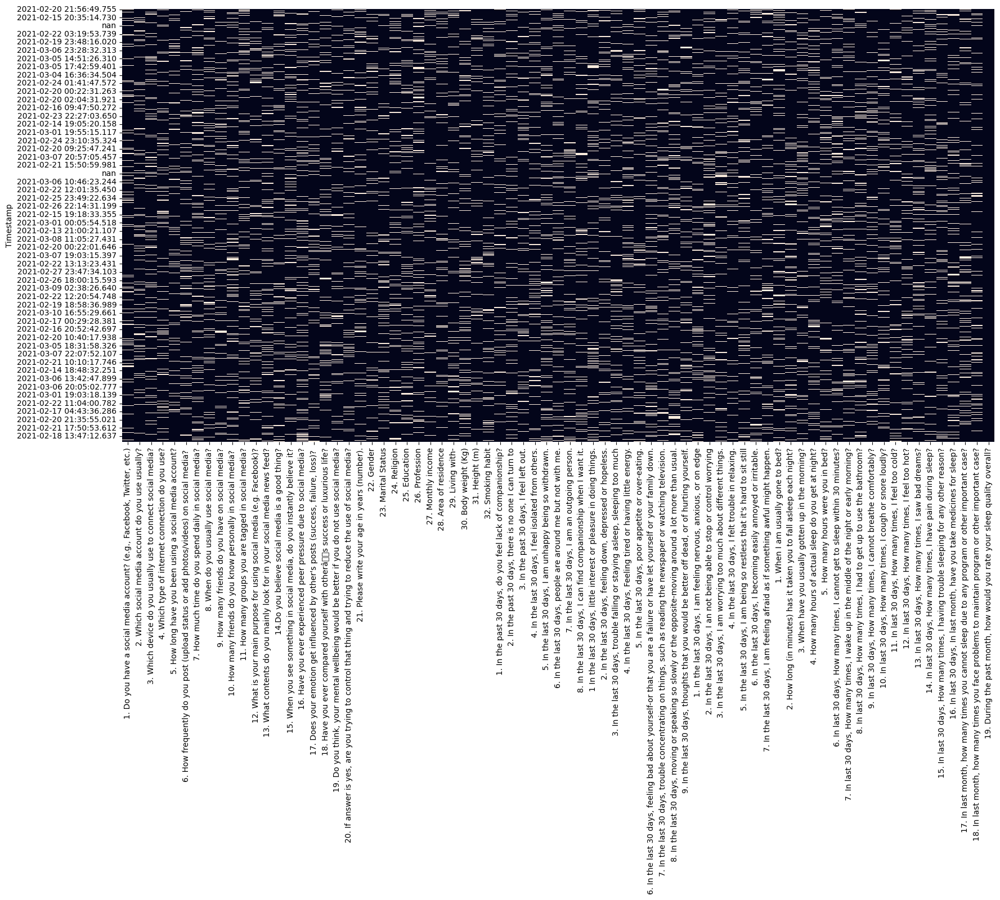
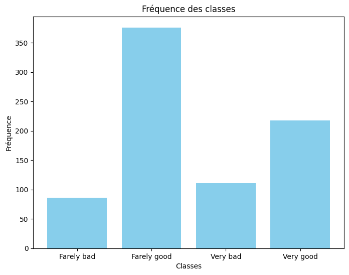
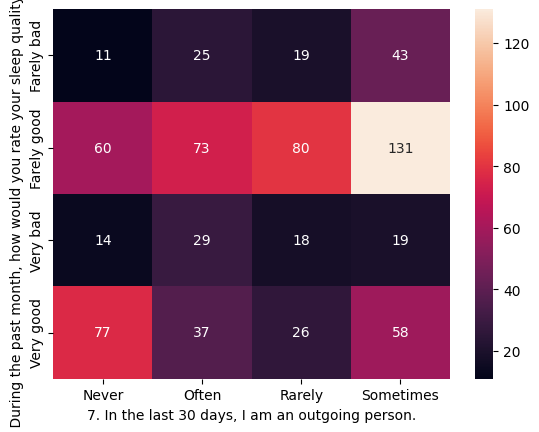
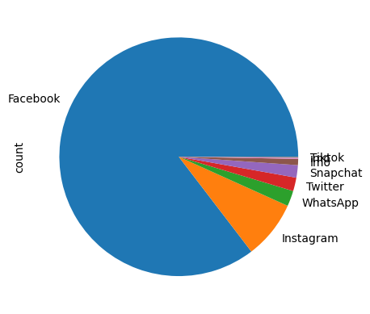

# 😴 Social Media Impact on Sleep - Predictive Analysis

## 📌 Project Overview
This project presents a comprehensive Machine Learning study on how social media usage patterns influence human sleep quality. Based on a dataset of **791 entries and 75 features**, the study follows a rigorous Data Science pipeline: from handling missing values and class imbalance to advanced model optimization.

## 📊 Dataset Insights
- **Source:** [ScienceDirect Research Data](https://www.sciencedirect.com/science/article/pii/S2352340921008684)
- **Features:** 75 attributes (Behavioral habits, Psychological scales, Demographics).
- **Target:** Sleep Quality (Categorized into 4 classes: Very Bad, Farely Bad, Farely Good, Very Good).
- **Challenge:** High class imbalance and a high number of categorical variables.

## 🛠 Preprocessing & Feature Engineering
To achieve high performance, the following techniques were applied:
- **Data Cleansing:** Removal of non-significant attributes and null value imputation.
- **Dimensionality Reduction:** Implementation of **PCA** (Principal Component Analysis) for model optimization.
- **Handling Imbalance:** Applied **SMOTE** (Synthetic Minority Over-sampling Technique) to balance the target classes.
- **Optimization:** Hyperparameter tuning using **GridSearchCV**.

## 🤖 Model Comparison & Results
I evaluated five different algorithms to find the most robust predictor:

| Model | Technique | Accuracy |
|:--- |:--- |:---:|
| **Random Forest** | **SMOTE + GridSearchCV** | **83%** |
| Naive Bayes | SMOTE | 62% |
| SVM | PCA Optimization | 55% |
| Logistic Regression | SMOTE | 52% |
| k-NN | GridSearchCV | 51% |

**Winning Model:** The **Random Forest Classifier** achieved the best performance with an accuracy of **83%**, demonstrating its ability to handle complex non-linear relationships in social data.

## 📊 Data Visualization & Insights

Detailed Exploratory Data Analysis (EDA) was performed to understand usage patterns and data quality.

| Data Quality & Cleaning | Target Distribution |
|:---:|:---:|
|  |  |
| *Visualizing missing data patterns* | *Analyzing sleep quality classes* |

| Feature Correlation | Usage Statistics |
|:---:|:---:|
|  |  |
| *Bivariate analysis of behavioral traits* | *Distribution of social media platforms* |

## 🛠 Tech Stack
- **Language:** Python
- **Environment:** Google Colab
- **Libraries:** `Scikit-Learn`, `Imbalanced-learn (SMOTE)`, `Pandas`, `Matplotlib`, `Seaborn`.

## 📈 Conclusion
The analysis confirms a strong correlation between digital habits and sleep disorders. The model can effectively predict potential sleep issues based on social media behavior, offering a tool for behavioral health awareness.

---
*Research and Implementation by Lynda7.*